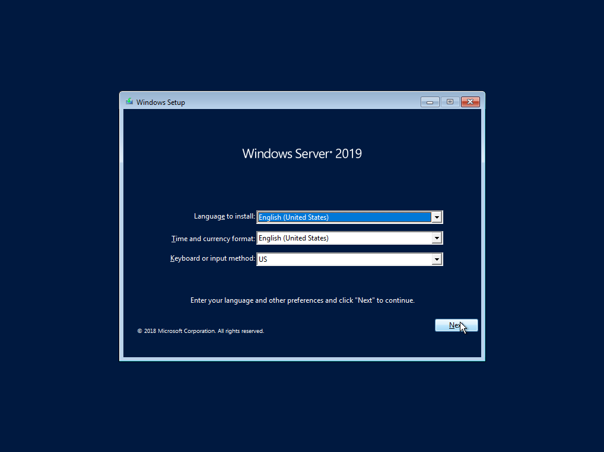

# Setup OS

## 1.Download IOS File Windoes Server 2019

เตรียมไฟล์ IOS สำหรับที่จะใช้ลงระบบปฏิบัติการเซิฟเวอร์

## 2.Selcet BIOS Boot with .ISO File

ให้เข้าหน้า BISO ด้วย F8, F9, F10, F11, F12 หรือ เลือก Boot กด Del และเลือกเป็น ISO File ที่เราเตรียมา

## 3.Wait Loading ...

รอจนอ่านไฟล์เส็จร

 (1).png>).png>)

## 4.Windoes Setup First Step

กดปุ่ม Next ด้านล่างขวา และ กดปุ่ม Install Now ตรงกลาง

(!) แนะนำให้ กด Next ไปเลย แล้วค่อยไปตั้งค่าเพิ่มภาษาของภูมิภาค  เราที่หลัง หากประเทศเราใช้ภาษากลางเป็น ภาษา English

.png>)

## 5.Windoes SetUp Last Step

กดที่ I don't have product key ด้านล่างซ้ายและ และ

กด  หากไม่มี Key สำหรับ Active Windoes

.png>).png>)
