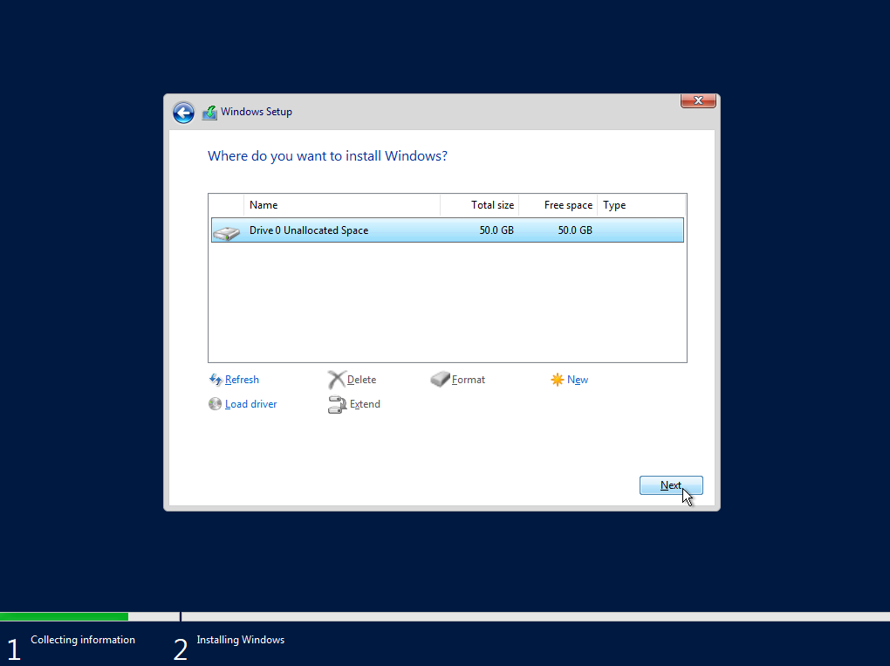

# SetUp OS

## 1.Download IOS File Windoes Server 2019

เตรียมไฟล์ IOS สำหรับที่จะใช้ลงระบบปฏิบัติการเซิฟเวอร์

## 2.Selcet BIOS Boot with .ISO File

ให้เข้าหน้า BISO ด้วย F8, F9, F10, F11, F12 หรือ เลือก Boot กด Del และเลือกเป็น ISO File ที่เราเตรียมา

## 3.Windoes Install First Step

<figure><figcaption></figcaption></figure>

 

<figure><figcaption></figcaption></figure>

3.1 กดปุ่ม Next ด้านล่างขวา และ กดปุ่ม Install Now ตรงกลาง

(!) แนะนำให้ กด Next ไปเลย แล้วค่อยไปตั้งค่าเพิ่มภาษาของภูมิภาค  เราที่หลัง หากประเทศเราใช้ภาษากลางเป็น ภาษา English

<figure><figcaption>
กดปุ่ม Next
</figcaption></figure>

 

<figure><figcaption>
กดปุ่ม Install Now
</figcaption></figure>

## 5.Windoes Install Last Step

5.1 กดที่ I don't have product key ด้านล่างซ้าย

(!) สำหรับ ไม่มี Key สำหรับ Active Windoes ไม่ต้องใส่

<figure><figcaption></figcaption></figure>

 

<figure><figcaption>
กด I don't have product key สีฟ้า
</figcaption></figure>

5.2 เลือกเป็น Operation system: Windoes 2019 Standard (Desktop Experience) และกด Next ด้านล่างซ้ายขวา

<figure><figcaption>
เลือก Windoes 2019 Standard (Desktop Experience)
</figcaption></figure>

 

<figure><figcaption>
กดปุ่ม Next
</figcaption></figure>

5.3 ติด CheckBox I accept the license terns ด้านล่างซ้าย และ กดปุ่ม Next ด้านล่างขวา

<figure><figcaption>
ติก CheckBox I accept the license terns
</figcaption></figure>

 

<figure><figcaption>
กดปุ่ม Next
</figcaption></figure>

5.4 กดเลือก Custom: Install Windoes only (advanced)

<figure><figcaption>
กดเลือก Custom: Install Windoes only (advanced) 
</figcaption></figure>

5.5

<figure><figcaption></figcaption></figure>

 

<figure><figcaption></figcaption></figure>

5.6

<figure><figcaption></figcaption></figure>

